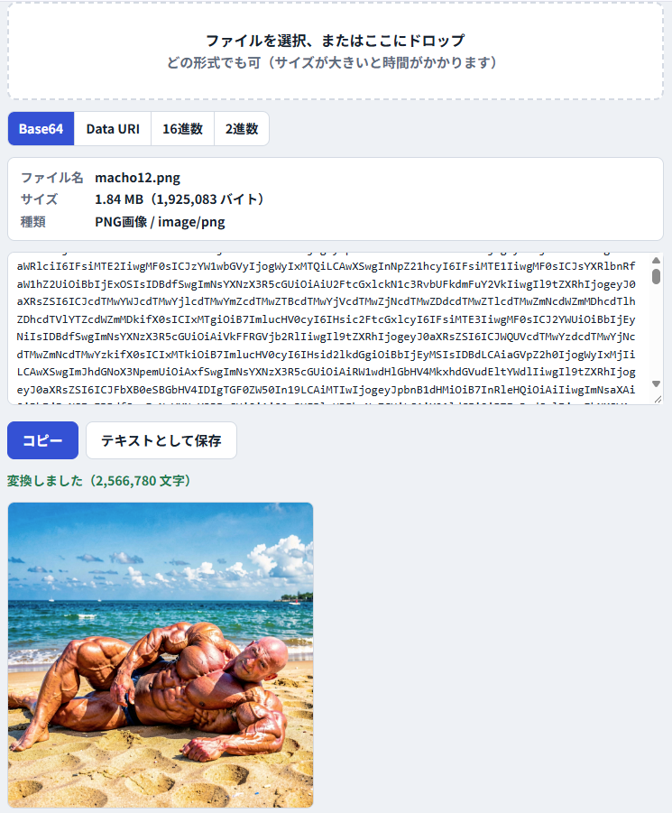
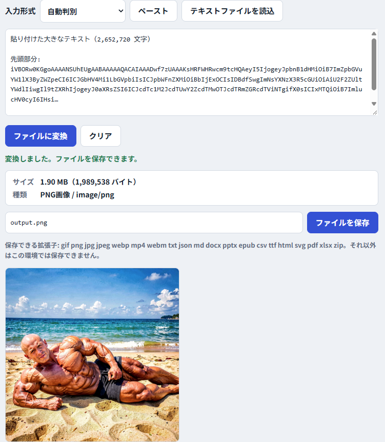

# Binary Maker WEB (ファイル ⇄ Base64・バイナリ変換ツール)

**Binary Maker WEB** は、Zip、画像、動画、音声、PDF、Officeファイルなど、あらゆるファイルを Base64 / Data URI / 16進数 / 2進数 のテキストに変換し、逆にテキストからファイルへ復元できるWebツールです。
HTML・CSS・JavaScript だけで動作し、ビルドやサーバーは不要です。処理はすべてブラウザ内で完結し、ファイルやテキストが外部に送信されることはありません。

## 🔗公開ページ
[https://OtabiHirohito.github.io/BinaryMakerWEB/](https://OtabiHirohito.github.io/BinaryMakerWEB/)

## 🚀 主な機能

### ファイル → テキスト
- ファイルの選択、またはドラッグ＆ドロップで変換
- 出力形式: Base64 / Data URI / 16進数 / 2進数
- 結果のコピー、テキストファイルとしての保存
- ファイルの種類とサイズの表示
- 画像・動画・音声のプレビュー

### テキスト → ファイル
- Base64、Data URI、16進数、2進数を貼り付けてファイルに復元
- 入力形式の自動判別（手動指定も可）
- クリップボードからのペースト、テキストファイルの読み込み
- 先頭バイトからファイル形式を判定し、拡張子を自動設定
- 復元したファイルのプレビューと16進ダンプ表示

### 全文表示オプション
画面上部の「全文表示」ボタンで切り替えます。

| | オフ | オン |
|---|---|---|
| 変換結果 | 先頭30万文字まで表示 | 全文を表示 |
| 大きな入力テキスト（10万文字超） | 入力欄に展開せず内部で保持 | 入力欄に全文を展開 |
| 16進ダンプ | 先頭256バイト | 全バイト |

オフの間も、コピー・保存・変換には常に全文が使われます。オンにすると大きなデータで動作が重くなります。

## 判別できるファイル形式

PNG / JPEG / GIF / WebP / PDF / MP4 / MOV / M4A / WebM / MP3 / WAV / Ogg / ZIP / GZIP / RAR / 7z / docx / xlsx / pptx / epub / 旧Office形式（doc・xls・ppt）/ テキスト

docx・xlsx・pptx は ZIP の内部構造から判別します。判別できない場合は `.bin` になります。保存時にファイル名は自由に変更できます。

## 使い方

1. `index.html` をブラウザで開く（ダブルクリックで動作します）
2. 上のタブで「ファイル → テキスト」か「テキスト → ファイル」を選ぶ

## 注意事項

- 大きなファイルをテキスト化すると元のサイズより大きくなります（Base64は約1.33倍、16進数は約3倍、2進数は約9倍）。
- 数十MBを超えるファイルは、ブラウザのメモリ不足や動作の重さにつながる場合があります。
- ブラウザのセキュリティ設定によっては、ペーストボタンがクリップボードを読み取れないことがあります。その場合は入力欄に直接貼り付けてください（Ctrl+V / Cmd+V）。

## 🤝 寄付について

   このソフトを気に入っていただけた場合は、よろしければ以下の寄付先への支援をご検討ください。
本ソフトおよび制作者はリンク先の組織とは一切関係がございません。

* [寄付先一覧](https://otabihirohito.github.io/DonationDirectory/)
* [ランダム寄付先](https://otabihirohito.github.io/DonationDirectory/random.html)

## 📄 ライセンス

  このプロジェクトは **MITライセンス** のもとで公開されています。詳細は [LICENSE.txt](LICENSE.txt) をご覧ください。

---

 Created by 大度寛仁 / X (Twitter): [@OtabiHirohito](https://x.com/OtabiHirohito)
